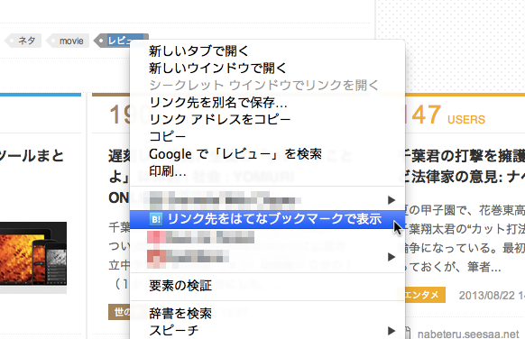

# HatebuContextMenu

はてなブックマークを右クリックメニューから呼び出すChrome拡張です。  
はてなブックマークの呼び出しは、右クリックをした場所によって呼び出し方が違います。

[Chrome ウェブストア - HatebuContextMenu](https://chrome.google.com/webstore/detail/hatebucontextmenu/koagohdkmbmhhkjkmmhaefbiihnnlilp?hl=ja)

## 通常メニューの使い方
Webページの適当な箇所で右クリックをした場合です。  
余白など好きなところで右クリックをすると下図のメニューが表示されます。  
このメニューでは現在表示しているページのはてなブックマークページを別タブで開くことが出来ます。

## リンクメニューの使い方
Webページのリンクテキスト上で右クリックをした場合です。
リンクテキスト上で下図のメニューが表示されます。
このメニューではリンク先URLのはてなブックマークページを別タブで開くことが出来ます。

